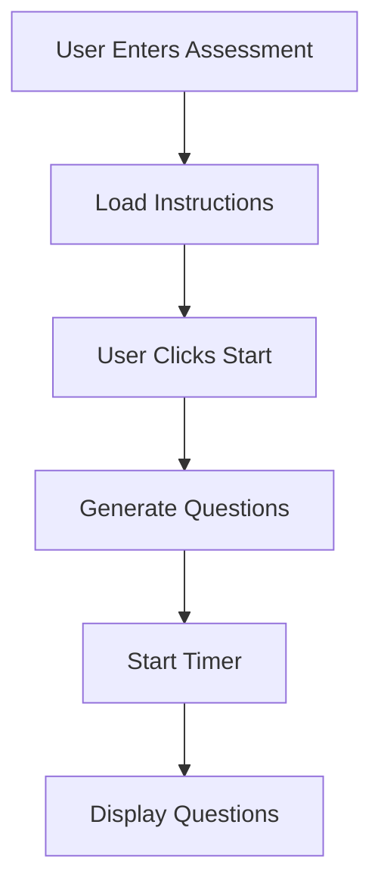

# Technical Assessment System Documentation

## Overview
The Technical Assessment System is a comprehensive evaluation platform designed to assess users' technical knowledge and problem-solving abilities. The system consists of multiple components working together to provide a secure, timed assessment experience with both multiple-choice and open-ended questions.

## System Constants

All system constants are centralized in `components/assessment-components/constants.ts` for easy maintenance and updates.

### Time Constants
```typescript
export const ASSESSMENT_SESSION_EXPIRY = 3 * 60 * 60 * 1000; // 3 hours in milliseconds
export const ASSESSMENT_TIME_LIMITS = {
  COHORT_2: 180, // 3 hours in minutes
  COHORT_3: 60,  // 1 hour in minutes
  DEEPTECH: 60,  // 1 hour in minutes
} as const;
```

### Question Counts
```typescript
export const QUESTION_COUNTS = {
  MCQ_QUESTIONS_PER_MODULE: 50,
  OPEN_ENDED_QUESTIONS_PER_MODULE: 0,
} as const;
```

### Security Settings
```typescript
export const SECURITY = {
  MAX_WARNINGS: 3,
  WINDOW_SIZE_THRESHOLD: 100,
  WARNING_DURATION: 4000, // milliseconds
  ERROR_DURATION: 5000,   // milliseconds
  INFO_DURATION: 6000,    // milliseconds
} as const;
```

### API Endpoints
```typescript
export const API_ENDPOINTS = {
  GENERATE_MCQ_QUESTIONS: '/api/generate_deeptech_assessment_questions/',
  GENERATE_OPEN_ENDED_QUESTIONS: '/api/generate_deeptech_openended_questions',
  EVALUATE_OPEN_ENDED_QUESTIONS: '/api/evaluate_open_ended_qs/',
  UPDATE_TECH_SCORE: '/api/update_tech_score/',
} as const;
```

### UI Constants
```typescript
export const UI = {
  TIMER_WARNING_THRESHOLD: 60, // seconds
  TIMER_CRITICAL_THRESHOLD: 40, // seconds
  TOAST_POSITION: 'top-center' as const,
} as const;
```

### Blocked Keyboard Shortcuts
```typescript
export const BLOCKED_SHORTCUTS = [
  'F12',
  'Ctrl+Shift+I',
  'Ctrl+Shift+J',
  'Ctrl+Shift+C',
  'Ctrl+U',
] as const;
```

### Type Definitions
```typescript
export type CohortType = keyof typeof ASSESSMENT_TIME_LIMITS;
export type ApiEndpoint = keyof typeof API_ENDPOINTS;
export type StorageKey = keyof typeof STORAGE_KEYS;
```

## System Architecture

### Core Components

1. **TechnicalAssessmentCard** (`components/TechnicalDeepTechAssessmentCard.tsx`)
   - Main container component that orchestrates the entire assessment flow
   - Manages state and session persistence
   - Coordinates between different assessment components

2. **Instructions** (`components/assessment-components/Instructions.tsx`)
   - Displays initial assessment instructions
   - Provides information about assessment structure and rules
   - Handles the start assessment button

3. **TestGenerator** (`components/assessment-components/TestGenerator.tsx`)
   - Manages question generation process
   - Handles API calls for both MCQ and open-ended questions
   - Manages session storage

4. **AssessmentTest** (`components/assessment-components/AssessmentTest.tsx`)
   - Renders and manages the actual test interface
   - Handles user answers and scoring
   - Manages timer and submission

5. **Timer** (`components/assessment-components/Timer.tsx`)
   - Displays countdown timer
   - Provides visual feedback for time remaining
   - Triggers auto-submission when time expires

6. **TimeUpDialog** (`components/assessment-components/TimeUpDialog.tsx`)
   - Displays when assessment time expires
   - Informs user about auto-submission

7. **useDevToolsDetection** (`components/assessment-components/useDevToolsDetection.ts`)
   - Custom hook for security monitoring
   - Detects developer tools usage
   - Manages warnings and auto-submission

## Data Flow

### 1. Assessment Initialization


### 2. Question Generation Process
1. System calls `/api/generate_deeptech_assessment_questions/` for MCQ questions
2. System calls `/api/generate_deeptech_openended_questions` for open-ended questions
3. Questions are stored in local storage with timestamp
4. Session data structure:
```typescript
interface AssessmentSession {
  questions: {
    mcqQuestions: MCQQuestion[];
    openEndedQuestions: OpenEndedQuestion[];
  };
  answers: {
    userAnswers: Record<number, string>;
    openEndedAnswers: Record<number, string>;
  };
  timestamp: number;
  timeRemaining: number;
}
```

### 3. Assessment Flow
1. **Initial State**
   - Load saved session if exists
   - Check session expiry (ASSESSMENT_SESSION_EXPIRY: 3 * 60 * 60 * 1000 ms)
   - Set time limit based on cohort using ASSESSMENT_TIME_LIMITS:
     - COHORT_2: 180 minutes
     - COHORT_3: 60 minutes
     - DEEPTECH: 60 minutes

2. **During Assessment**
   - Timer counts down
   - User answers are saved to local storage
   - Developer tools detection active (using SECURITY constants)
   - Warning system for suspicious activity (MAX_WARNINGS: 3)

3. **Submission Process**
   - Calculate MCQ scores
   - Evaluate open-ended questions via API_ENDPOINTS.EVALUATE_OPEN_ENDED_QUESTIONS
   - Calculate weekly scores
   - Submit results to API_ENDPOINTS.UPDATE_TECH_SCORE
   - Clear local storage

## Security Features

### 1. Developer Tools Detection
- Monitors window size differences (WINDOW_SIZE_THRESHOLD: 100)
- Prevents keyboard shortcuts (BLOCKED_SHORTCUTS)
- Implements warning system (MAX_WARNINGS: 3)
- Auto-submits on violation
- Toast durations:
  - Warning: 4000ms
  - Error: 5000ms
  - Info: 6000ms

### 2. Session Management
- Session expiry after ASSESSMENT_SESSION_EXPIRY (3 * 60 * 60 * 1000 ms)
- Local storage for persistence (STORAGE_KEYS.ASSESSMENT_SESSION)
- Auto-save of answers
- Secure submission process

## Question Management

### 1. MCQ Questions
- Questions per module: QUESTION_COUNTS.MCQ_QUESTIONS_PER_MODULE (50)
- Direct comparison with correct answers
- Score calculation: `(correctAnswers / totalQuestions) * 100`

### 2. Open-ended Questions
- Questions per module: QUESTION_COUNTS.OPEN_ENDED_QUESTIONS_PER_MODULE (0)
- API-based evaluation
- Score structure:
```typescript
interface WeeklyScore {
  week: string;
  totalScore: number;
  maxPossibleScore: number;
  percentage: string;
  mcqScore: number;
  openEndedScore: number;
  mcqPercentage: string;
  openEndedPercentage: string;
}
```

## UI Features

### 1. Timer Display
- Warning threshold: UI.TIMER_WARNING_THRESHOLD (60 seconds)
- Critical threshold: UI.TIMER_CRITICAL_THRESHOLD (40 seconds)
- Toast position: UI.TOAST_POSITION ('top-center')

## Error Handling

### 1. API Errors
- MCQ generation failure
- Open-ended question generation failure
- Scoring submission failure

### 2. User Errors
- Invalid answers
- Session expiry
- Developer tools usage

## State Management

### 1. Local Storage
- Session persistence
- Answer tracking
- Time remaining

### 2. React State
- Question management
- Answer tracking
- UI state
- Timer state

## UI Components

### 1. Instructions Screen
- Assessment overview
- Structure explanation
- Start button

### 2. Test Interface
- MCQ questions with radio buttons
- Open-ended questions with text areas
- Timer display
- Submit button

### 3. Results Screen
- Score display
- Weekly breakdown
- Dashboard navigation

## API Endpoints

All API endpoints are defined in constants.ts:

1. `API_ENDPOINTS.GENERATE_MCQ_QUESTIONS`
   - Generates MCQ questions
   - Parameters: course, ratings, cohort

2. `API_ENDPOINTS.GENERATE_OPEN_ENDED_QUESTIONS`
   - Generates open-ended questions
   - Parameters: course, ratings, cohort

3. `API_ENDPOINTS.EVALUATE_OPEN_ENDED_QUESTIONS`
   - Evaluates open-ended answers
   - Parameters: questions, answers

4. `API_ENDPOINTS.UPDATE_TECH_SCORE`
   - Updates final scores
   - Parameters: mcqScore, openEndedScore, scores

## Best Practices

1. **Code Organization**
   - Component separation
   - Type safety
   - Error handling
   - State management

2. **Security**
   - Developer tools detection
   - Session management
   - Secure API calls

3. **User Experience**
   - Clear instructions
   - Progress tracking
   - Error feedback
   - Time management

## Contributing

When contributing to this system, please ensure:

1. **Type Safety**
   - Use TypeScript interfaces
   - Validate props
   - Handle edge cases

2. **Testing**
   - Test component rendering
   - Test API integration
   - Test error handling

3. **Documentation**
   - Update this documentation
   - Add component comments
   - Document API changes

4. **Security**
   - Maintain security features
   - Test security measures
   - Handle edge cases

## Future Improvements

1. **Performance**
   - Optimize API calls
   - Improve state management
   - Enhance caching

2. **Features**
   - Add question randomization
   - Implement progress saving
   - Add detailed analytics

3. **Security**
   - Enhance developer tools detection
   - Add more security measures
   - Improve session management 